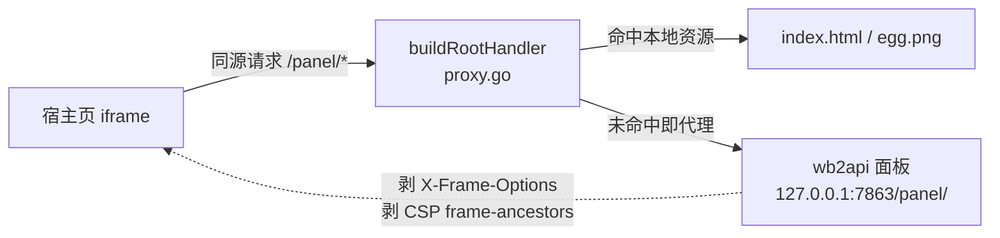
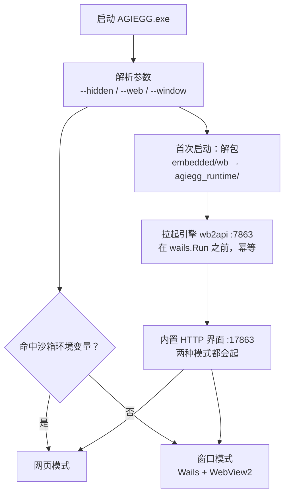
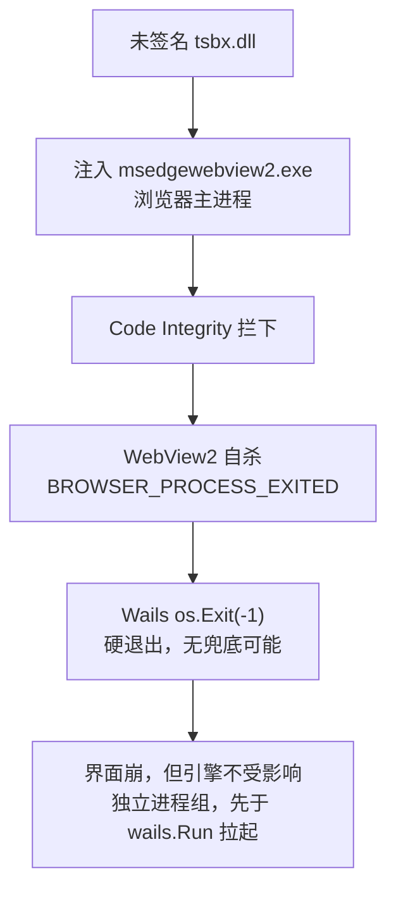

<p align="center">
  
</p>

<h1 align="center">AGIEGG · 账号池启动器</h1>

<p align="center">
  
  
  
  
  
  
</p>

---

把一个「账号池中转站」打包成一个 **单文件便携桌面启动器**：双击即用，
开机自启，托盘常驻，一键签到。界面只做启动器 + 一键操作，不做复杂管理。

| 项目 | 说明 |
|---|---|
| 名字 | **AGIEGG**，图标是一枚带裂纹的鸡蛋（`build/windows/icon.ico` / `embedded/icon.png`） |
| 内置引擎 | **WorkBuddy**（wb2api，`:7863`）—— 只此一池，Trae 已下线 |
| 打包方式 | 引擎二进制、`config.json`、`auths/` 账号文件全部 `go:embed` 进单个 exe |
| 运行方式 | 自动解包到 exe 同级的 `agiegg_runtime/` 并拉起引擎 |

> [!IMPORTANT]
> **clone 后必读**：仓库里的密钥**全部是占位符**。`embedded/agiegg.env` 的
> `WB_API_KEY` 与 `embedded/wb/config.json` 的 `api_key` 必须改成你自己的值（两者保持一致），
> 然后**重新 `go build`** —— 这两个文件是 `go:embed` 编进 exe 的，改完不重编等于没改。
> 详解见「[八、填入你自己的密钥](#八填入你自己的密钥)」。
> 仓库同时也不含任何账号文件（`embedded/wb/auths/` 已忽略），需自行放入。

---

## 目录

- [一、界面与功能](#一界面与功能)
  - [管理面板：路径必须探测，不能硬编码](#管理面板路径必须探测不能硬编码)
  - [管理面板：在窗口内打开（不跳浏览器）](#管理面板在窗口内打开不跳浏览器)
  - [两种界面模式](#两种界面模式)
- [二、运行机制（重要）](#二运行机制重要)
  - [便携性](#便携性)
- [三、WebView2 崩溃与网页模式（本机实测踩坑）](#三webview2-崩溃与网页模式本机实测踩坑)
  - [症状](#症状) · [根因](#根因有证据不是猜的) · [关键代码事实](#关键代码事实) · [应对（三层）](#应对三层) · [安全](#安全)
- [四、构建](#四构建)
  - [环境](#环境) · [关键：必须带 build tag](#关键必须带-build-tag) · [图标 / 版本信息](#图标--版本信息) · [托盘图标必须是 ICO](#托盘图标必须是-ico)
- [五、开机自启（不走注册表）](#五开机自启不走注册表)
- [六、目录结构](#六目录结构)
- [七、已验证 / 已知限制](#七已验证--已知限制)
- [八、填入你自己的密钥](#八填入你自己的密钥)

---

## 一、界面与功能

窗口默认 **1200×800**（3:2），**可自由缩放 / 最大化**（下限 780×560；内容宽 ≤900px 时
双栏自动折叠成单列）。默认尺寸经 `fitToScreen` 按主屏分辨率钳一次，
1366×768 等低分屏打开也不会溢出。

风格为 **GitHub (Primer)**：

```
深色顶栏 #24292f（面包屑「AGIEGG / 账号池启动器」）
下划线导航 tab（概览 / 引擎日志，选中橙色下划线 #fd8c73）
白盒组件（#f6f8fa 盒头、#d1d9e0 细边框、6px 小圆角）
绿色主按钮 #1f883d（一键签到/启动）+ 彩色标签 chips
Actions 风格深色日志台 #0d1117
```

概览页为双栏：左＝引擎 Box（指标 / 文件列表式账号明细 / 按钮行），右＝快捷操作 / 设置 / 关于；
日志独立成 tab 全宽展示。窗口可缩放，面板 zoom 按内容区宽度动态计算（见下节）。

**设计纪律（taste-skill）**：视觉规范按 [taste-skill](https://github.com/Leonxlnx/taste-skill)
（design-taste-frontend）校验过一轮，落地了这些硬性条款 ——
图标全部来自**官方 Octicons**（primer/octicons，`fill:currentColor` 随文字变色，不手绘 SVG）；
可见文本**零 em/en 破折号**（未知值统一显示 `-`）；每行**间隔点 `·` 至多 1 个**
（端口与 pid 并成一段、健康图例改 `/` 分隔、页脚至多两段）；`prefers-reduced-motion` 时
关闭全部动画/过渡；设计决策以 DESIGN READ 注释形式写在 `index.html` 头部。

| 区域 | 说明 |
|---|---|
| 顶部 | 鸡蛋 logo、版本号、当前模式徽标（原生窗口 / 浏览器模式） |
| 汇总条 ×4 | **引擎**（运行中/已停止 + 自身运行时长）、**账号**（总数 + 国区/国际分布）、**健康**（+ 可用百分比）、**剩余积分**（+ 总额与占比） |
| 引擎卡片 | 左侧状态竖条 + 状态灯 + 状态胶囊；右上角技术信息（`:端口 · pid · 运行时长/外部实例`）；三个指标块（账号总数 / 剩余积分 / 健康·冷却·禁用，后两者带进度条）；**可折叠的账号明细**（昵称、国区/国际、待过期额度、剩余/总额、冷却/禁用标记） |
| 卡片按钮 | 启动（运行中自动禁用置灰）/ 停止 / 重启 / 签到 / 管理面板（**在窗口内打开**，该引擎没有面板时自动禁用并提示原因） |
| 一键操作 | `一键签到`、`积分查询`、`重启引擎` |
| 开机自启 | 开关：写入/删除「启动」文件夹快捷方式，开机后静默驻留托盘 |
| 日志区 | 双 tab：**运行输出**（本工具的操作结果）/ **引擎日志**（引擎自身尾部输出，能看到自动任务启用情况） |
| 页脚 | 本次启动时间、模式、备用界面地址 + 「浏览器打开本界面」/「打开账号目录」次级入口 |

**动态信息**：系统托盘提示与窗口标题都会实时显示概况
（`AGIEGG 运行中 · 4 账号 · 9285 积分`），窗口最小化后悬停任务栏即可看到。

**系统托盘菜单**：显示窗口 / 隐藏窗口 / **在浏览器打开界面** / 启动引擎 / 停止引擎 / 立即签到 / 退出。

关闭窗口 = 收起到托盘（不退出）；只有托盘「退出」才真正结束。

### 管理面板：路径必须探测，不能硬编码

wb2api 的面板**不在根路径**（实测）：

| 路径 | 结果 |
|---|---|
| `/` | **404** |
| `/panel/` | 真正的控制台 |
| `/panel` | 301 跳向 `/panel/` |

所以 `OpenPanel()` 是**运行时探测** `/panel/` → `/`，命中才打开；
结果缓存（成功 60 秒 / 失败 10 秒 —— 引擎刚拉起时面板可能尚未注册路由）。
探测不到时返回明确错误，界面按钮置灰并引导用户看「账号明细」。

> [!NOTE]
> 早期版本硬编码打开根路径 `/`，而 wb2api 的 `/` 是 404 —— 这就是「管理面板打不开」的原因。

### 管理面板：在窗口内打开（不跳浏览器）

「管理面板」按钮现在用**全屏 iframe 内嵌**在启动器窗口里打开控制台，
顶栏提供「返回 / 刷新 / 浏览器打开」三个操作，`Esc` 也可返回。



实现要点：

1. **必须反代，不能直接 iframe**：wb2api 面板响应带 `X-Frame-Options: DENY`
   和 `Content-Security-Policy: frame-ancestors 'none'`（实测响应头），
   跨源嵌入必被浏览器拦下。`proxy.go` 把引擎镜像到界面同一源下并剥掉这三个头，
   面板页面、`app.js`、`/panel/api/*` 全部原样转发（面板请求全在 `/panel/` 前缀下，
   无 WebSocket；策略是「界面资源未命中即代理」，面板以后加路径不用改代码）。
2. **同一套路由服务两条通路**：`buildRootHandler()` 同时挂在内置 HTTP 服务和
   Wails `AssetServer.Handler` 上（后者非 GET 请求与资源未命中的 GET 都会落到
   Handler；`/wails/*` 运行时路径由 Wails 内部先行处理，不会进代理）。
3. **免登录**：面板把登录态存自己的 `localStorage`（`wb2api.key`，请求带
   `Authorization: Bearer`）。宿主页与面板经反代同源，`PanelInfo()` 把内嵌密钥
   交给前端预置，打开即是已登录状态；主题也预置为浅色，与启动器观感一致。
4. **面板缩放自适应**：面板表格（`.tbl-wrap`）放下全部操作列需要约 1287px 虚拟宽，
   打开面板时按内容区宽度注入 `zoom = 宽 / 1287`（封顶 1.0 不放大、保底 0.7，
   再窄交给表格横向滚动；窗口 resize 时 rAF 合帧同步刷新，同源所以可注入）。
   定标实测：

   | zoom | 结果 |
   |---|---|
   | `1.00` | 操作列被面板自身布局裁 60px |
   | `0.95` | 仍裁 17px |
   | `≈0.92`（1287px） | 起完整放下（签到/余额/任务/禁用/移除五按钮） |

5. **面板换肤统一风格**：引擎面板是 CSS 变量驱动的（`[data-theme="light"]` 一组令牌），
   宿主页 load 后同源注入 `#agiegg-skin` 样式，把画布（`#f6f8fa`）、边框（`#d1d9e0`）、
   文字灰阶、主色（蓝 → **Primer 绿 `#1f883d`**）、字体栈整体对齐启动器令牌，
   两个界面看起来是一个产品；面板升级不改变量名就一直生效，另加 `.tbl-wrap` 溢出
   滚动兜底。

### 两种界面模式

程序内置一个 **HTTP 界面服务**，因此界面有两条通路，前端会自动选择：

| 模式 | 触发 | 界面 |
|---|---|---|
| 窗口模式（默认） | 双击 exe | Wails 原生窗口（WebView2），走 JS 绑定 |
| 网页模式 | `--web`，或双击 `AGIEGG-网页模式.cmd` | 默认浏览器打开 `http://127.0.0.1:17863/`，走 `/api/call` |

网页模式**完全不加载 WebView2**，因此在浏览器进程被安全软件干扰的机器上依然可用。
详见「[三、WebView2 崩溃与网页模式](#三webview2-崩溃与网页模式本机实测踩坑)」。

---

## 二、运行机制（重要）



1. **首次启动**会把内嵌的 `wb/` 解包到 `AGIEGG.exe` 同级的 `agiegg_runtime/`。
   引擎要写 `data/state.json` 和日志，不能直接在只读的 embed 文件系统上跑。
   - 已存在且大小一致的文件会跳过，因此**用户改过的 `config.json` / `auths/` 会保留**。
   - 只想重置：删掉整个 `agiegg_runtime/` 再启动。
2. 引擎在 `wails.Run` **之前**拉起，所以即使界面起不来，自动任务/自动签到照常运行。
3. 签到/活动/保活/积分刷新全部由引擎 **自带调度**（`config.json` 的 `schedule`）执行，启动器不重复实现。
4. `start()` 是幂等的：端口已在监听就跳过，不会重复拉起。

### 便携性

`AGIEGG.exe` **单独一个文件**就能拷到别的机器：到新机器首次运行会自动解包出全部内容。
（机器上已有的 `agiegg_runtime/` 可以一起拷，省一次解包。）

---

## 三、WebView2 崩溃与网页模式（本机实测踩坑）

### 症状

窗口闪一下就弹框：

> The WebView2 process crashed and the application needs to be restarted.

日志里是：

```text
[WebView2] Environment created successfully
ERR | WebVie2wProcess failed with kind 6
ERR | WebVie2wProcess failed with kind 4
ERR | WebVie2wProcess failed with kind 0     ← browser process exited，致命
```

kind 含义：

| kind | 含义 |
|---|---|
| `0` | browser process exited（致命） |
| `1` | render |
| `3` | frame render |
| `4` | utility |
| `6` | GPU |

### 根因（有证据，不是猜的）

Windows 事件日志 `Microsoft-Windows-CodeIntegrity/Operational` 里反复出现：

```text
Code Integrity determined that a process
(\Device\...\EdgeWebView\Application\154.0.4258.37\msedgewebview2.exe)
attempted to load \Device\...\workbuddy\...\cli\vendor\sandbox\5.6.10\tsbx.dll
that did not meet the Microsoft signing level requirements.
```



即：**某个未签名 DLL（`tsbx.dll`）被注入进 `msedgewebview2.exe` 的浏览器主进程**，
被代码完整性检查拦下 → WebView2 杀掉自己 → Wails 硬退出。

排查要点：

- 不是火绒（本机确有 `HipsTray.exe`/`HipsDaemon.exe`，但被拒的是 workbuddy 的 DLL）。
- 不是 `AppInit_DLLs`、不是 `IFEO`（都查过，是空的）—— **是进程树内的注入**，
  因此**由谁启动决定了会不会中招**：从沙箱/宿主进程派生的会中招，从资源管理器双击的不会。

### 关键代码事实

Wails 在 `BROWSER_PROCESS_EXITED` 时是**硬退出**，拦不住：

```go
// internal/frontend/desktop/windows/frontend.go:538-539
winc.Errorf(f.mainWindow, "%s", messages.WebView2ProcessCrash)
os.Exit(-1)
```

所以 `if err != nil { select{} }` 这种兜底是**死代码**，写在这里只为说明此处无法恢复。

> [!WARNING]
> `WebviewDisableRendererCodeIntegrity: true`（`windows.Options`）实测**无效** ——
> 它作用于渲染/工具进程，而拦截发生在浏览器主进程。

### 应对（三层）

1. **自动识别隔离沙箱**：检测 `LSBOX_AUDIT_SHMEM` / `SANDBOX_CENTER_IPC_ADDRESS` /
   `CODEBUDDY_SAFE_DELETE_SANDBOX` 环境变量，命中则自动切网页模式，不再弹崩溃框。
   用 `--window` 可强制走原生窗口。
2. **内置 HTTP 界面作为备份通路**：无论哪个模式都会起 `127.0.0.1:17863`。
   即使窗口崩了，浏览器打开这个地址即可继续操作。托盘也有「在浏览器打开界面」。
3. **崩溃提示改成可操作的**：把默认英文弹框换成中文，并带上网页界面地址。

### 安全

HTTP 界面只绑本地回环；写操作要求自定义头 `X-AGIEGG: 1`，
跨站请求会因浏览器预检失败而被拦下（已实测无头返回 `{"ok":false,"error":"forbidden"}`）。

---

## 四、构建

### 环境

- Go 1.25（本机在 `C:\go-sdk\go`，需 `GOROOT` 指向它）
- 依赖缓存放在 G 盘，避免撑爆 C 盘：

  ```bash
  export GOMODCACHE="G:/工作/wbegg/.gocache/mod"
  export GOCACHE="G:/工作/wbegg/.gocache/build"
  ```

### 关键：必须带 build tag

Wails 的 `internal/app` 用 `//go:build dev` / `//go:build production` 区分实现。
**不带 tag 的 `go build` 会编译到 `app_default_windows.go` 这个桩实现**：
`CreateApp` 弹「缺少 build tag」对话框并返回 `(nil, nil)`，`Run()` 直接返回 `nil` ——
表现为程序秒退、`OnStartup` 不执行、没有任何日志。

```bash
go build -tags "desktop,production" \
         -ldflags="-H windowsgui" \
         -o build/AGIEGG.exe .
```

### 图标 / 版本信息

Windows 的 exe 图标靠 resource object（`.syso`），`go build` 不会自动加。
用 `go-winres` 生成，产物 `rsrc_windows_amd64.syso` 会被链接器自动拾取：

```bash
go install github.com/tc-hib/go-winres@latest
go-winres init                       # 生成 winres/winres.json
# 把鸡蛋 PNG 放到 winres/icon.png，按需编辑 winres.json
go-winres make --arch=amd64 --product-version=1.0.0.0 --file-version=1.0.0.0
```

### 托盘图标必须是 ICO

`systray.SetIcon()` 会把字节写入**无扩展名**的临时文件再交给 Windows `LoadImage`，
`LoadImage` 只认 ICO/BMP —— **传 PNG 会静默失败**（日志只有一句
`unable to set icon: The operation completed successfully.`）。
所以嵌入的是 `embedded/icon.ico`。

---

## 五、开机自启（不走注册表）

本机 `reg.exe` 被安全策略拦截，所以用**启动文件夹快捷方式**：

| 项 | 值 |
|---|---|
| 路径 | `%APPDATA%\Microsoft\Windows\Start Menu\Programs\Startup\AGIEGG.lnk` |
| 参数 | **`--web --hidden`** |
| 效果 | 开机后只驻留托盘 + 后台服务、**不弹窗、不开浏览器** |
| 创建方式 | `powershell.exe -Command` 内联脚本（走 argv UTF-16，中文路径不会像 `.ps1` 那样被 GBK 解码搞乱） |

> [!TIP]
> 不用原生窗口自启，是因为 WebView2 初始化失败会硬退出 + 弹框，每次开机弹一次很烦。

---

## 六、目录结构

```text
agiegg/
├── main.go          # 参数解析（--hidden/--web/--window）、沙箱识别、wails.Run、托盘 goroutine
├── webserver.go     # 内置 HTTP 界面 + /api/call 分发（不依赖 WebView2 的备用通路）
├── proxy.go         # 引擎反代 + 统一路由：管理面板内嵌进窗口的关键（剥 XFO/CSP）
├── app.go           # App 绑定方法：Status/Start/Stop/Restart/Signin/Credits/自启/托盘
├── engine.go        # 引擎进程管理（隐藏窗口 + 进程组 + taskkill 兜底）、乱码容错解码
├── config.go        # 读内嵌 agiegg.env
├── embed.go         # //go:embed 资产与图标
├── winres/          # exe 图标 / 版本信息（go-winres）
├── build/windows/   # icon.ico
├── build/           # AGIEGG.exe + AGIEGG-网页模式.cmd + agiegg_runtime/ + 界面截图
├── embedded/        # 引擎与账号（打进 exe）
│   ├── agiegg.env   # 端口与密钥
│   ├── icon.ico     # 托盘图标（必须 ICO）
│   ├── icon.png     # 界面里的鸡蛋 logo
│   └── wb/          # wb2api + config.json + auths/ + signin.exe + credit.exe
│                    # （原 trae/ 已整目录删除：26MB）
└── frontend/dist/   # index.html（启动器 UI + 内嵌面板视图）+ egg.png
```

---

## 七、已验证 / 已知限制

### 已实测通过（2026-09-30）

| 项 | 结果 |
|---|---|
| 带 tag 编译 | exe **48.2 MB**（去掉 Trae 池的 26MB 资产后从 75.2 MB 降下来） |
| 沙箱自动识别 | 在沙箱内不带参数启动 → 日志 `网页模式：界面地址 http://127.0.0.1:17863/` |
| 内置界面 | `index.html` / `egg.png` 均 HTTP 200 |
| 接口鉴权 | 无 `X-AGIEGG` 头 → `{"ok":false,"error":"forbidden"}` |
| 一键签到 | `SigninAll` 退出码 0，WB 4 账号（3 已签 / 1 失败） |
| 积分查询 | WB 4/4 账号 **9285/13747（67%）** |
| 状态接口 | `web_mode=true`，wb running+online，账号数 4 |
| 引擎自动拉起 | 杀掉旧引擎后 AGIEGG 自行启动 `wb2api`(7863)；`tw2api` 不再被拉起（7864 无监听） |
| 汇总口径 | `all_running=1`、`all_accounts=4`、`all_healthy=4`、`all_credits=9285/13747` |
| 账号明细（`Accounts`） | wb 返回 4 条：获嘉青年 328/4147(cn)、hnqhj 48/690(global)、17302649453 4460/4460(cn)、18737323174 4449/4450(cn) |
| 面板探测 | wb `panel_ok=true → http://127.0.0.1:7863/panel/`（与直接 curl 200 一致） |
| `OpenPanel` | wb → `{"ok":true}` |
| 界面渲染 | 无头 Edge（684×729 视口，即 700×772 窗口的内容区）测得 `scrollHeight = clientHeight = 729`，一屏放全无溢出；浅色主题见「[一](#一界面与功能)」 |
| 面板反代（实测 2026-09-30 晚） | `:17863/panel/` 200 且响应头已无 `X-Frame-Options`/`Content-Security-Policy`；`/egg.png` 仍走本地；无 `X-AGIEGG` 头的 `/api/call` 仍 403 |
| 窗口内面板 | CDP 点击「管理面板」→ iframe 全屏加载、遮罩消失、**免登录**直接显示账号池数据（预置 key + 浅色主题生效） |
| 账号明细展开动画 | grid-rows `0fr→1fr` 平滑展开，展开后列表高 117px、页底 841px（窗口内可滚动，预期内） |
| 默认视图回归 | 加宽/面板改造后 684×729 视口 `footBottom=724`，一屏无溢出不变 |

### 限制

1. **窗口模式依赖 WebView2，且可能被进程注入搞崩** —— 见「[三](#三webview2-崩溃与网页模式本机实测踩坑)」。
   崩溃时引擎不受影响（引擎在 `wails.Run` 之前拉起、独立进程组），
   但界面会退出并弹框；此时请用网页模式或浏览器打开 `127.0.0.1:17863`。
2. **Trae 池已下线**（2026-09-30）：余额接口始终取不到数（与本启动器无关，
   上游 API 变更 —— `cannot unmarshal number 2650.02 into Go struct field
   .usage_summary.consumed_amount of type int64`），且其面板/积分都不可用，
   故整体移除：不再 embed、不再解包、不再拉起、界面不再显示。
   `embedded/trae/`、`build/agiegg_runtime/trae/` 两个目录（各 26MB）与
   Trae 专用的 `embedded/login-assist.sh` **已删除**，共释放约 52MB。
3. 引擎类工具（`signin.exe`）**按字节数对齐列宽**，会把中文昵称截成半个字符。
   `toUTF8()` 已按「非法序列占比」判定编码并丢弃残缺字节，不会再全篇乱码，
   但被截断的那个字本身无法还原。

---

## 八、填入你自己的密钥

本仓库**不含任何真实密钥**，占位符有两个位置，改完必须重新 `go build`：

| 文件 | 字段 | 说明 |
|---|---|---|
| `embedded/agiegg.env` | `WB_API_KEY` | 启动器传给引擎的 Bearer 密钥（经 `WB2A_API_KEY` 环境变量注入） |
| `embedded/wb/config.json` | `api_key` | 引擎自身配置里的同名密钥，**必须与上面一致** |

`TRAE_API_KEY` / `TRAE_PORT` 可留空或填 `0` —— Trae 池已下线（见「[七-2](#限制)」），
`config.go` 根本不读这两个键。

正确做法：

```bash
# 1. 改这两个文件里的占位符，换成你自己的值（两处保持一致）
# 2. 重新编译 —— 这两个文件是 go:embed 编进 exe 的，不重编等于没改
go build -tags "desktop,production" -ldflags="-H windowsgui" -o build/AGIEGG.exe .
```

**账号文件同样不入库**：`embedded/wb/auths/` 下只提交了 `.gitkeep`，真实账号
JSON 已被 `.gitignore` 排除（`embedded/wb/auths/*.json`）。clone 后需自行放入
账号文件，否则引擎起来后账号池为空。

> [!TIP]
> 维护者注意：本地保留真实值时，可用
> `git update-index --skip-worktree embedded/agiegg.env embedded/wb/config.json`
> 让本地工作区仍是自己的真值、而入库版本始终是占位符。
